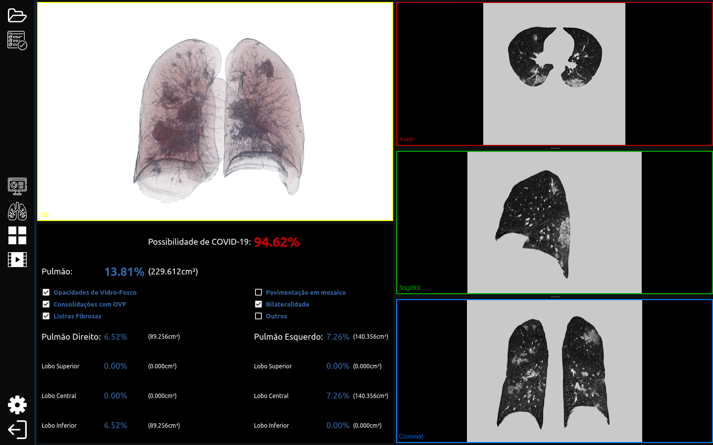
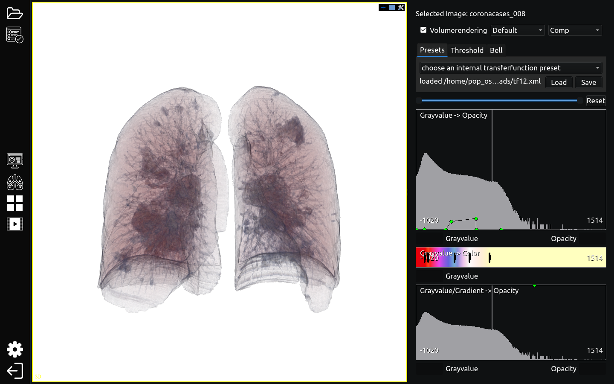
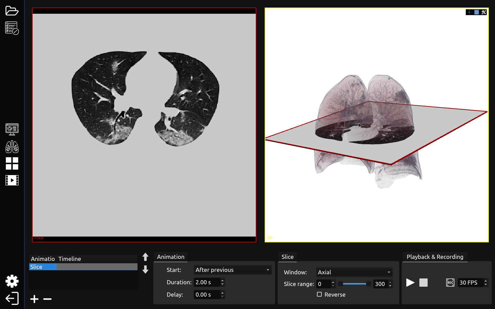
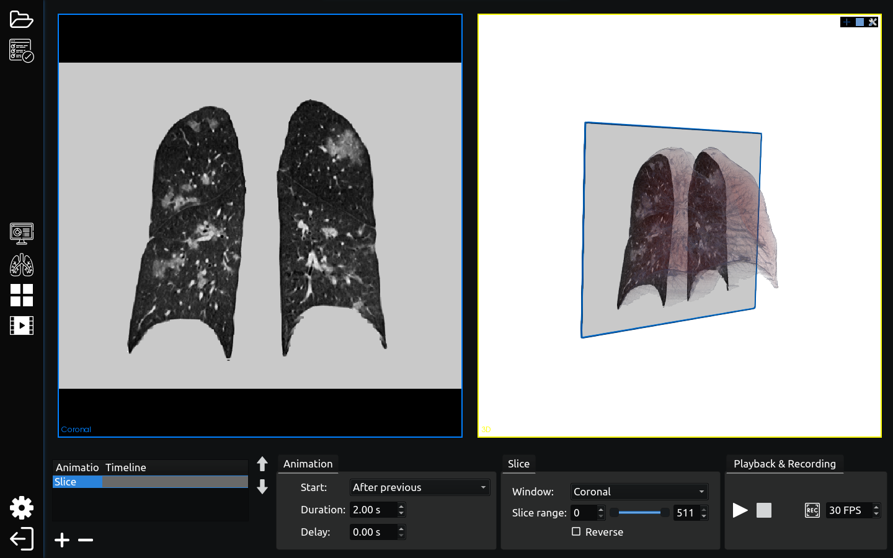

# CIDIA-GUI

This is the code to the graphical interface used in the CIDIA project promoted by UFRGS (Universidade Federal do Rio Grande do Sul).

**Note:** This is a work in progress, right now, features are constantly changing names and capabilities.

## The Medical Imaging Interaction Toolkit (MITK) 
All features are heavily dependent on the MITK project.

## Modules 
The features of this application are divided as modules. 

**Note for developers:** Actually they are almost copies of the respective MITK's plugins but whitout the dependecie on the blue berry library. 

### Statistics
For now, this is only a concept.

### Volume Rendering

In this mode, the user can change the transfer function used to render the three dimensional medical image contained in the dataset.

### Movie Maker

Allows you to create basic animations of your scene and to record them to video files. Individual animations are arranged in a timeline and can be played back sequential or in parallel.

##### Axial Perspective:

 

##### Coronal Perspective:

 